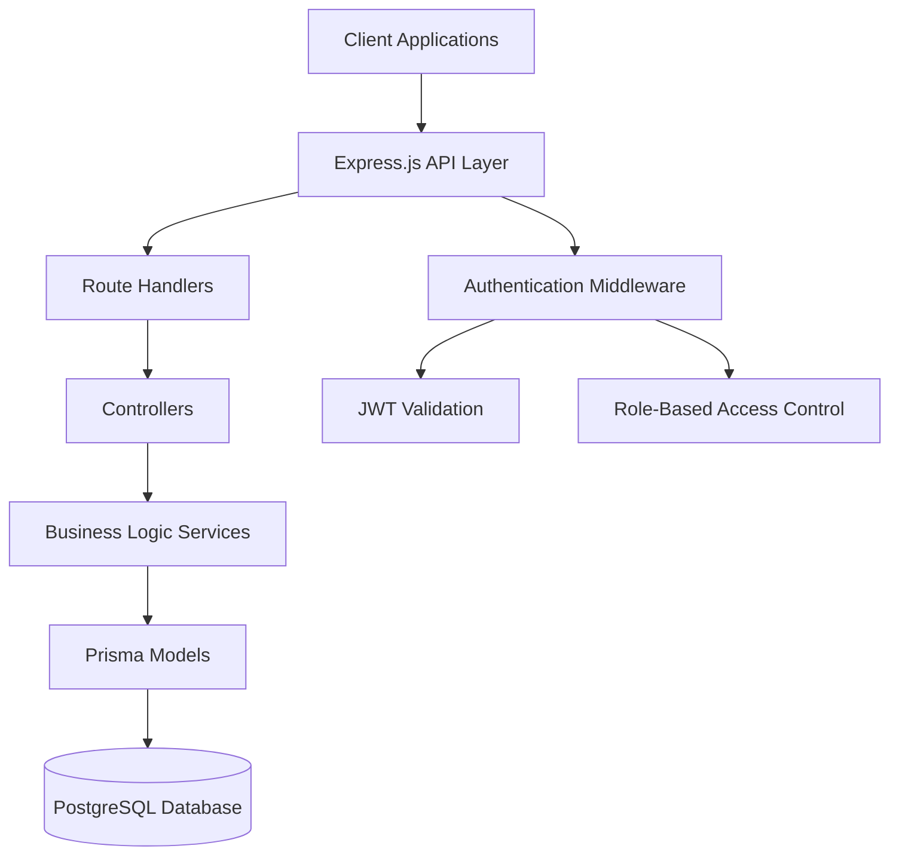

# Design Document

## Overview

GearGuard is a Node.js-based maintenance management system built with Express.js, PostgreSQL, and Prisma ORM. The system follows a layered architecture with clear separation of concerns, implementing RESTful API patterns with JWT authentication and role-based authorization. The design emphasizes scalability, maintainability, and adherence to enterprise-grade backend development practices.

## Architecture

### High-Level Architecture



### Technology Stack

- **Runtime**: Node.js
- **Framework**: Express.js
- **Database**: PostgreSQL
- **ORM**: Prisma
- **Authentication**: JWT (jsonwebtoken)
- **Password Hashing**: bcrypt
- **Validation**: express-validator
- **Environment Management**: dotenv

### Project Structure

```
backend/
├── src/
│   ├── config/
│   │   ├── database.js
│   │   └── jwt.js
│   ├── controllers/
│   │   ├── authController.js
│   │   ├── userController.js
│   │   ├── teamController.js
│   │   ├── equipmentController.js
│   │   ├── requestController.js
│   │   └── dashboardController.js
│   ├── middleware/
│   │   ├── auth.js
│   │   ├── rbac.js
│   │   ├── validation.js
│   │   └── errorHandler.js
│   ├── models/
│   │   └── index.js
│   ├── routes/
│   │   ├── auth.js
│   │   ├── users.js
│   │   ├── teams.js
│   │   ├── equipment.js
│   │   ├── requests.js
│   │   └── dashboard.js
│   ├── services/
│   │   ├── authService.js
│   │   ├── userService.js
│   │   ├── teamService.js
│   │   ├── equipmentService.js
│   │   ├── requestService.js
│   │   └── logService.js
│   ├── utils/
│   │   ├── constants.js
│   │   ├── helpers.js
│   │   └── validators.js
│   ├── app.js
│   └── server.js
├── prisma/
│   ├── schema.prisma
│   └── migrations/
├── .env
├── package.json
└── README.md
```

## Components and Interfaces

### Database Schema (Prisma)

```prisma
model User {
  id        Int      @id @default(autoincrement())
  name      String
  email     String   @unique
  password  String
  role      Role
  teamId    Int?
  createdAt DateTime @default(now())
  
  team              Team?               @relation(fields: [teamId], references: [id])
  createdRequests   MaintenanceRequest[] @relation("RequestCreator")
  assignedRequests  MaintenanceRequest[] @relation("RequestAssignee")
  logEntries        RequestLog[]
  
  @@map("users")
}

model Team {
  id        Int      @id @default(autoincrement())
  name      String
  createdAt DateTime @default(now())
  
  users               User[]
  equipment           Equipment[]
  maintenanceRequests MaintenanceRequest[]
  
  @@map("teams")
}

model Equipment {
  id           Int       @id @default(autoincrement())
  name         String
  serialNumber String    @unique
  department   String
  location     String
  purchaseDate DateTime
  warrantyEnd  DateTime?
  teamId       Int
  isScrapped   Boolean   @default(false)
  createdAt    DateTime  @default(now())
  
  team                Team                 @relation(fields: [teamId], references: [id])
  maintenanceRequests MaintenanceRequest[]
  
  @@map("equipment")
}

model MaintenanceRequest {
  id            Int                    @id @default(autoincrement())
  subject       String
  description   String
  type          MaintenanceType
  status        MaintenanceStatus      @default(NEW)
  equipmentId   Int
  teamId        Int
  assignedTo    Int?
  scheduledDate DateTime?
  durationHours Float?
  createdBy     Int
  createdAt     DateTime               @default(now())
  
  equipment Equipment @relation(fields: [equipmentId], references: [id])
  team      Team      @relation(fields: [teamId], references: [id])
  assignee  User?     @relation("RequestAssignee", fields: [assignedTo], references: [id])
  creator   User      @relation("RequestCreator", fields: [createdBy], references: [id])
  logs      RequestLog[]
  
  @@map("maintenance_requests")
}

model RequestLog {
  id        Int      @id @default(autoincrement())
  requestId Int
  oldStatus MaintenanceStatus?
  newStatus MaintenanceStatus
  changedBy Int
  changedAt DateTime @default(now())
  
  request MaintenanceRequest @relation(fields: [requestId], references: [id])
  user    User               @relation(fields: [changedBy], references: [id])
  
  @@map("request_logs")
}

enum Role {
  ADMIN
  MANAGER
  TECHNICIAN
}

enum MaintenanceType {
  CORRECTIVE
  PREVENTIVE
}

enum MaintenanceStatus {
  NEW
  IN_PROGRESS
  REPAIRED
  SCRAP
}
```

### API Layer Design

#### Authentication Middleware
- JWT token validation
- Role-based access control
- Request context enrichment with user data

#### Controller Pattern
- Thin controllers focusing on HTTP concerns
- Input validation using express-validator
- Delegation to service layer for business logic
- Consistent error handling and response formatting

#### Service Layer
- Business logic implementation
- Database operations through Prisma
- Transaction management for complex operations
- Business rule enforcement

### Key Interfaces

#### Authentication Service
```javascript
interface AuthService {
  login(email: string, password: string): Promise<{user: User, token: string}>
  validateToken(token: string): Promise<User>
  hashPassword(password: string): Promise<string>
  comparePassword(password: string, hash: string): Promise<boolean>
}
```

#### Equipment Service
```javascript
interface EquipmentService {
  createEquipment(data: CreateEquipmentDto): Promise<Equipment>
  updateEquipment(id: number, data: UpdateEquipmentDto): Promise<Equipment>
  scrapEquipment(id: number): Promise<Equipment>
  getEquipmentByTeam(teamId: number): Promise<Equipment[]>
  validateEquipmentForRequest(equipmentId: number): Promise<boolean>
}
```

#### Request Service
```javascript
interface RequestService {
  createRequest(data: CreateRequestDto): Promise<MaintenanceRequest>
  assignRequest(requestId: number, technicianId: number): Promise<MaintenanceRequest>
  updateStatus(requestId: number, status: MaintenanceStatus, userId: number): Promise<MaintenanceRequest>
  completeRequest(requestId: number, durationHours: number, userId: number): Promise<MaintenanceRequest>
  scrapRequest(requestId: number, userId: number): Promise<MaintenanceRequest>
}
```

## Data Models

### Core Entities

#### User Model
- Represents system users with role-based permissions
- Encrypted password storage using bcrypt
- Team association for access control
- Audit trail through created and assigned requests

#### Team Model
- Organizational unit for equipment and user grouping
- Enables role-based access control
- Supports equipment ownership and maintenance responsibility

#### Equipment Model
- Asset tracking with comprehensive metadata
- Team ownership for maintenance assignment
- Scrap status to prevent new maintenance requests
- Warranty tracking for business intelligence

#### Maintenance Request Model
- Central workflow entity with status tracking
- Type classification (corrective/preventive)
- Team-based assignment rules
- Duration tracking for reporting

#### Request Log Model
- Complete audit trail for all status changes
- User attribution for accountability
- Timestamp tracking for performance analysis

### Business Rules Implementation

#### Equipment Assignment Rules
- Equipment must belong to a team upon creation
- Scrapped equipment cannot receive new maintenance requests
- Equipment team determines eligible technicians for assignment

#### Request Workflow Rules
- New requests automatically inherit team from equipment
- Assignment limited to technicians within equipment's team
- Status progression: NEW → IN_PROGRESS → REPAIRED/SCRAP
- Completion requires duration entry
- Scrap requests automatically scrap associated equipment

#### Access Control Rules
- Admins: Full system access
- Managers: Equipment and request management within organization
- Technicians: View and update assigned requests only

## Error Handling

### Error Categories
1. **Authentication Errors**: Invalid tokens, expired sessions
2. **Authorization Errors**: Insufficient permissions
3. **Validation Errors**: Invalid input data
4. **Business Logic Errors**: Rule violations, workflow constraints
5. **Database Errors**: Connection issues, constraint violations
6. **System Errors**: Unexpected server errors

### Error Response Format
```javascript
{
  success: false,
  error: {
    code: "ERROR_CODE",
    message: "Human-readable error message",
    details: {}, // Additional error context
    timestamp: "2024-01-01T00:00:00Z"
  }
}
```

### Error Handling Strategy
- Global error handler middleware
- Consistent error response formatting
- Appropriate HTTP status codes
- Error logging for debugging and monitoring
- Graceful degradation for non-critical failures

## Testing Strategy

### Unit Testing
- Service layer business logic testing
- Utility function testing
- Model validation testing
- Mock external dependencies

### Integration Testing
- API endpoint testing
- Database integration testing
- Authentication flow testing
- Role-based access control testing

### Test Structure
```
tests/
├── unit/
│   ├── services/
│   ├── utils/
│   └── models/
├── integration/
│   ├── auth/
│   ├── equipment/
│   ├── requests/
│   └── dashboard/
└── fixtures/
    ├── users.js
    ├── teams.js
    └── equipment.js
```

### Testing Tools
- **Jest**: Testing framework
- **Supertest**: HTTP assertion testing
- **Prisma Test Environment**: Database testing setup
- **Factory Pattern**: Test data generation

### Test Coverage Goals
- Service layer: 90%+ coverage
- Controller layer: 80%+ coverage
- Critical business logic: 100% coverage
- API endpoints: 100% coverage

## Security Considerations

### Authentication Security
- JWT tokens with appropriate expiration
- Secure password hashing with bcrypt
- Token refresh mechanism
- Session invalidation capabilities

### Authorization Security
- Role-based access control enforcement
- Resource-level permissions
- Team-based data isolation
- API endpoint protection

### Data Security
- Input validation and sanitization
- SQL injection prevention through Prisma
- XSS protection through proper encoding
- Rate limiting for API endpoints

### Infrastructure Security
- Environment variable management
- Database connection security
- CORS configuration
- Security headers implementation

## Performance Considerations

### Database Optimization
- Proper indexing strategy
- Query optimization
- Connection pooling
- Database migrations management

### API Performance
- Response caching where appropriate
- Pagination for large datasets
- Efficient query patterns
- Request/response compression

### Scalability Design
- Stateless application design
- Horizontal scaling capability
- Database read replicas support
- Microservice-ready architecture

This design provides a solid foundation for building a production-ready maintenance management system that meets all specified requirements while maintaining scalability, security, and maintainability.